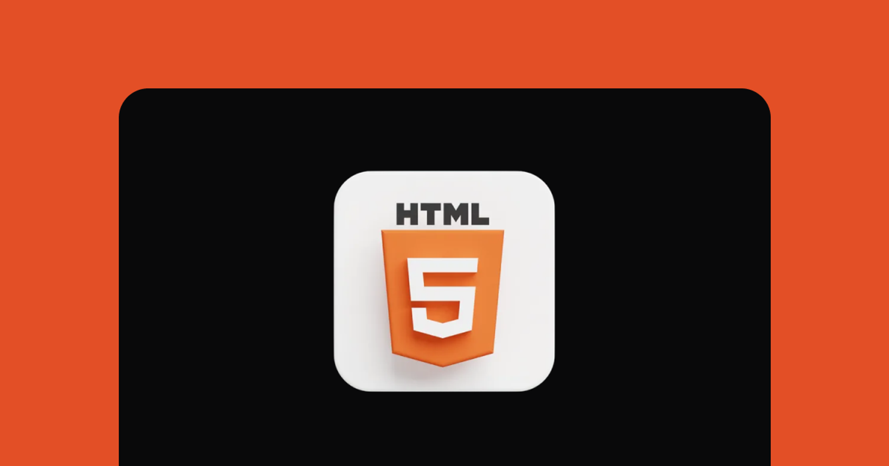

<h1 align="center"> Desafios HTML </h1>

Série de desafios feitos para colocar em prática conceitos vistos no programa de estudos Discover da Rocketseat.

  <a href="#-tecnologias">Tecnologias</a>&nbsp;&nbsp;&nbsp;|&nbsp;&nbsp;&nbsp;
  <a href="#-projeto">Projeto</a>&nbsp;&nbsp;&nbsp;|&nbsp;&nbsp;&nbsp;
  <a href="#-layout">Layout</a>&nbsp;&nbsp;&nbsp;|&nbsp;&nbsp;&nbsp;
  <a href="#memo-licença">Licença</a>

  

 

  

## 🚀 Tecnologias

Esse projeto foi desenvolvido com as seguintes tecnologias:

- HTML e CSS
- Git e Github

## 💻 Projeto

Os desafios abaixo se dedicam a treinar estruturas e tags básicas, corriqueiras e essenciais do HTML.

1. Glossário
2. Formulário de contato
3. Lista de compras
4. Quiz
5. Blog Post

## 🔖 Layout

Você pode visualizar o layout de cada exercício através [DESSE LINK](https://efficient-sloth-d85.notion.site/Desafios-HTML-ed0f6368d34d44ffab92686b9dc93229).

## :memo: Licença

Esse projeto está sob a licença MIT.

---

Feito com ♥ por eu mesmo graças à Rocketseat  :wave: [Participe da comunidade!](https://discord.gg/rocketseat)